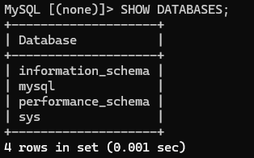

# AWS Secure 3-Tier Architecture

This project demonstrates the design and implementation of a secure 3-tier architecture on Amazon Web Services (AWS). The goal of this project is to simulate a real-world cloud deployment where application components are separated across different network layers and secured using industry best practices.

The architecture consists of:

- **Web Layer (Presentation Tier):** Amazon EC2 instance hosted in a public subnet running an Nginx web server  
- **Application/Data Layer:** Amazon RDS MySQL database deployed in private subnets  
- **Networking Layer:** Custom Virtual Private Cloud (VPC) with segmented subnets  
- **Security Layer:** Least privilege security group configurations controlling access between resources  

This setup ensures that sensitive components such as the database remain isolated and inaccessible from the public internet, while still allowing controlled communication from the application layer.

---

## Table of Contents

- [Architecture Overview](#architecture-overview)
- [VPC and Networking Setup](#vpc-and-networking-setup)
- [EC2 Web Server Setup](#ec2-web-server-setup)
- [RDS Database Setup](#rds-database-setup)
- [Security Configuration](#security-configuration)
- [Database Connection Validation](#database-connection-validation)
- [Commands Used](#commands-used)
- [Conclusion](#conclusion)

---

## Architecture Overview

The architecture follows a layered design to improve security, scalability, and maintainability:

- The **public subnet** hosts the EC2 instance, which serves web traffic
- The **private subnets** host the RDS database, ensuring it is not exposed to the internet
- Security groups enforce strict communication rules between components

This separation prevents direct external access to the database and limits potential attack surfaces.


---

## VPC and Networking Setup

A custom VPC was created to provide complete control over the network configuration and to isolate resources from AWS default networking.

---

### VPC Creation

The VPC acts as a logically isolated network where all resources are deployed.


---

### Subnet Design

Two types of subnets were created:

- **Public Subnet:** Used for internet-facing resources (EC2)
- **Private Subnets:** Used for backend services (RDS)

  
This subnet allows inbound and outbound internet traffic via an Internet Gateway.

  
These subnets do not have direct internet access, increasing security for sensitive resources.

---

### Subnet Overview


Expanded view showing multiple subnets across availability zones for redundancy:


---

### Internet Gateway Configuration

An Internet Gateway was attached to the VPC to enable internet access for resources in the public subnet.


---

### Route Table Configuration

A route table was configured to allow outbound internet traffic from the public subnet.


The route table was then explicitly associated with the public subnet:


This ensures only the public subnet has internet access, while private subnets remain isolated.

---

## EC2 Web Server Setup

An EC2 instance was deployed in the public subnet to act as the web server.

---

### Instance Deployment

The instance was launched and configured with appropriate networking and security settings.


---

### Web Server Installation

After connecting via SSH, Nginx was installed and started on the instance to serve web content.


---

### Custom Web Page Deployment

A custom HTML page was created and hosted on the EC2 instance to verify that the web server is functioning correctly.


This confirms that:
- The EC2 instance is accessible via the internet
- The web server is correctly configured

---

## RDS Database Setup

A managed MySQL database was deployed using Amazon RDS within private subnets.

---

### DB Subnet Group Creation

A DB subnet group was created using private subnets to ensure the database is not publicly accessible.


---

### Database Deployment

The RDS instance was created with the following key configurations:

- Engine: MySQL
- Deployment: Private subnets
- Public Access: Disabled
- Credentials: Manually configured


This ensures the database is isolated from the public internet and only accessible within the VPC.

---

## Security Configuration

Security groups were configured to enforce strict access control between resources.

---

### Initial Security Group Setup


---

### Least Privilege Implementation

The database security group was updated to allow inbound traffic only from the EC2 instance.

- Port: 3306 (MySQL)
- Source: EC2 Security Group


This ensures:
- No external/public access to the database
- Only authorized application resources can communicate with it

---

## Database Connection Validation

The final step involved validating connectivity between EC2 and RDS.



---

### Validation Process

From the EC2 instance:

1. Connected to the RDS instance using the MySQL client  
2. Retrieved existing databases  
3. Created a new test database  

This confirms:
- Network routing is correctly configured  
- Security groups allow controlled communication  
- RDS is operational and accessible only from EC2  

---

---

## Commands Used

### Connect to EC2
```bash
ssh -i web-key.pem ec2-user@13.236.67.120
```

### Update the EC2 Instance
```bash
sudo dnf update -y
```

### Install and Configure Nginx
```bash
sudo dnf install nginx -y
sudo systemctl start nginx
sudo systemctl enable nginx
sudo systemctl restart nginx
```

### Edit the Default Web Page
```bash
sudo nano /usr/share/nginx/html/index.html
```

### Connect to the RDS Instance from EC2
```bash
mysql -h database-1.c526c2qem0vk.ap-southeast-2.rds.amazonaws.com -u admin -p
```

### SQL Commands Used for Validation
```sql
SHOW DATABASES;
CREATE DATABASE testdb;
SHOW DATABASES;
```

---

## Conclusion

This project successfully demonstrates the implementation of a secure 3-tier architecture in AWS using a custom VPC, public and private subnets, an EC2 web server, and an RDS MySQL database. The final design ensures that the web server is publicly reachable while the database remains isolated in private subnets and accessible only through controlled security group rules. By configuring routing, Internet Gateway access, subnet segmentation, least privilege security groups, and validating secure EC2-to-RDS communication, this project reflects practical cloud security principles and provides hands-on experience with real AWS infrastructure deployment.
