# AWS Secure 3-Tier Architecture

This project demonstrates the design and implementation of a secure 3-tier architecture on AWS using EC2, RDS, and VPC networking. The architecture enforces network isolation and least privilege access control to protect backend resources.

---

## Table of Contents
- Overview
- Architecture Design
- Technologies Used
- Implementation Steps
- Security Configuration
- Database Setup and Testing
- Screenshots
- Key Learnings
- Future Improvements

---

## Overview

The goal of this project is to build a secure AWS environment where:
- A web server is publicly accessible
- A database is isolated in private subnets
- Communication between layers is tightly controlled

---

## Architecture Design

This architecture consists of:

- A custom VPC with CIDR block
- Public subnet for EC2 (web server)
- Private subnets for RDS database
- Internet Gateway for public access
- Route tables to control traffic flow
- Security groups enforcing least privilege

Traffic flow:
- Users → EC2 (public)
- EC2 → RDS (private)
- No direct external access to RDS

---

## Technologies Used

- Amazon EC2
- Amazon RDS (MySQL)
- Amazon VPC
- Subnets and Route Tables
- Internet Gateway
- Security Groups
- Nginx
- SSH
- MySQL CLI

---

## Implementation Steps

### 1. VPC Creation
- Created a custom VPC with appropriate CIDR range

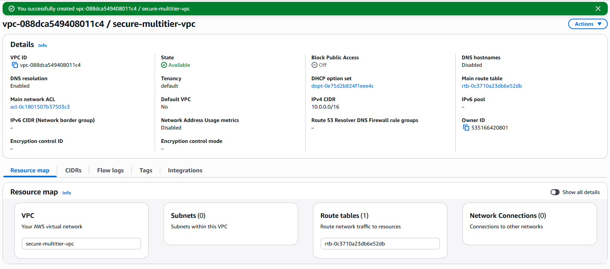

---

### 2. Subnet Configuration
- Created one public subnet
- Created two private subnets across different AZs

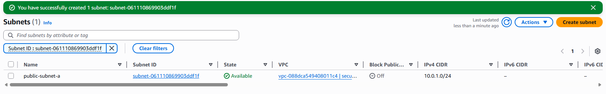
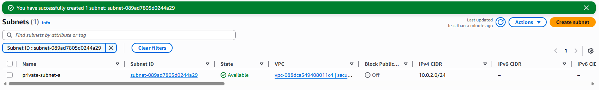
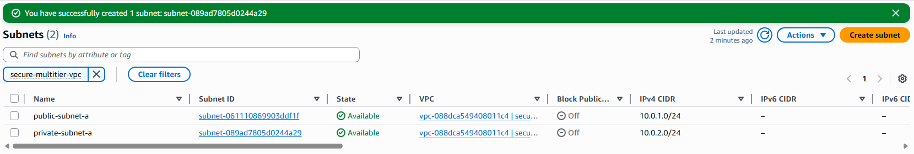
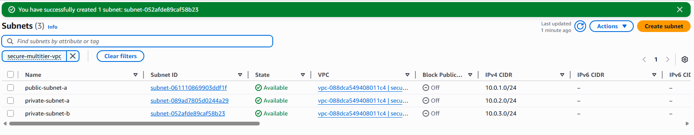

---

### 3. Internet Gateway
- Created and attached an Internet Gateway to the VPC

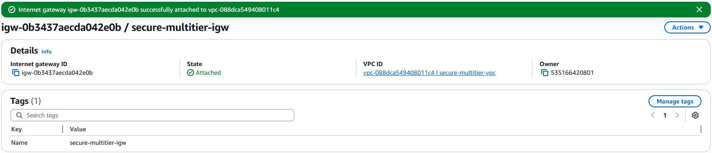

---

### 4. Route Table Configuration
- Created public route table
- Added route to Internet Gateway
- Associated with public subnet

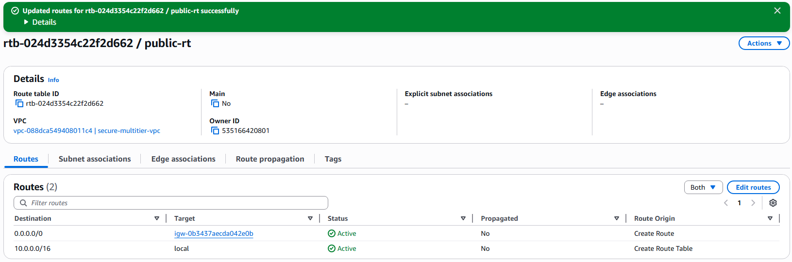
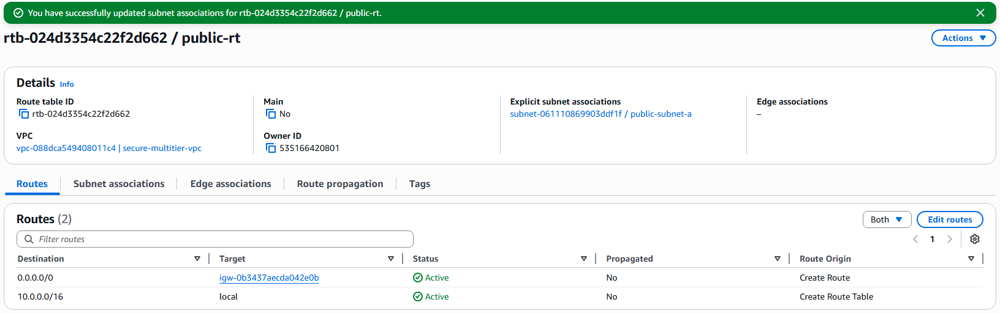

---

### 5. EC2 Web Server Setup
- Launched EC2 instance in public subnet
- Installed Nginx
- Verified public access

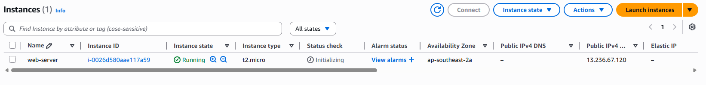
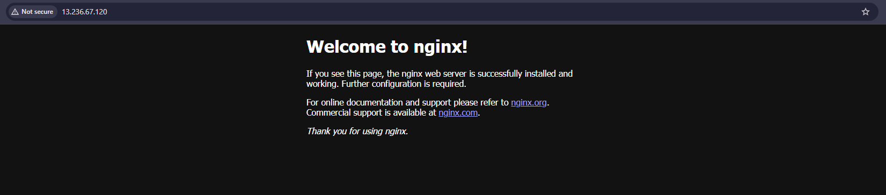
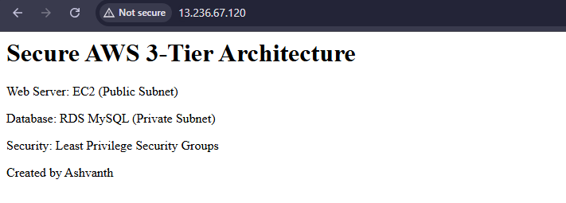

---

### 6. RDS Subnet Group
- Created DB subnet group using private subnets

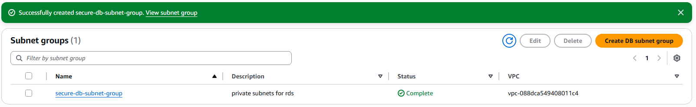

---

### 7. RDS Database Setup
- Created MySQL RDS instance
- Disabled public access
- Placed in private subnet group

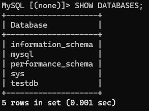

---

### 8. Security Groups Configuration

#### EC2 Security Group
- Allowed inbound:
  - HTTP (80)
  - SSH (22)

#### RDS Security Group
- Allowed inbound:
  - MySQL (3306) from EC2 security group only

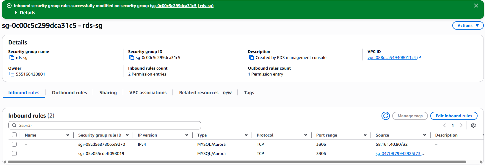
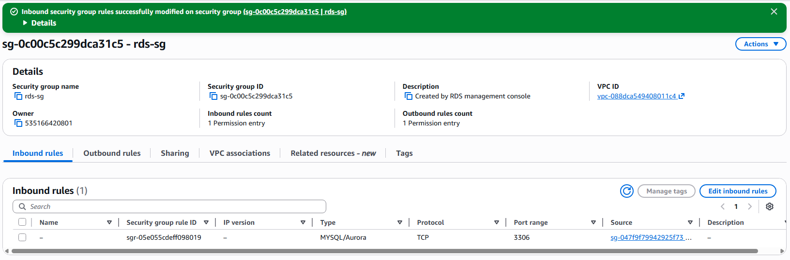

---

## Security Configuration

This project applies the following security principles:

- Database is deployed in private subnets
- No public IP assigned to RDS
- Database access restricted to EC2 security group
- No direct internet access to backend resources
- Network segmentation using subnets

---

## Database Setup and Testing

Connected to RDS from EC2 instance using MySQL client:

```bash
mysql -h database-1.c526c2qem0vk.ap-southeast-2.rds.amazonaws.com -u admin -p
